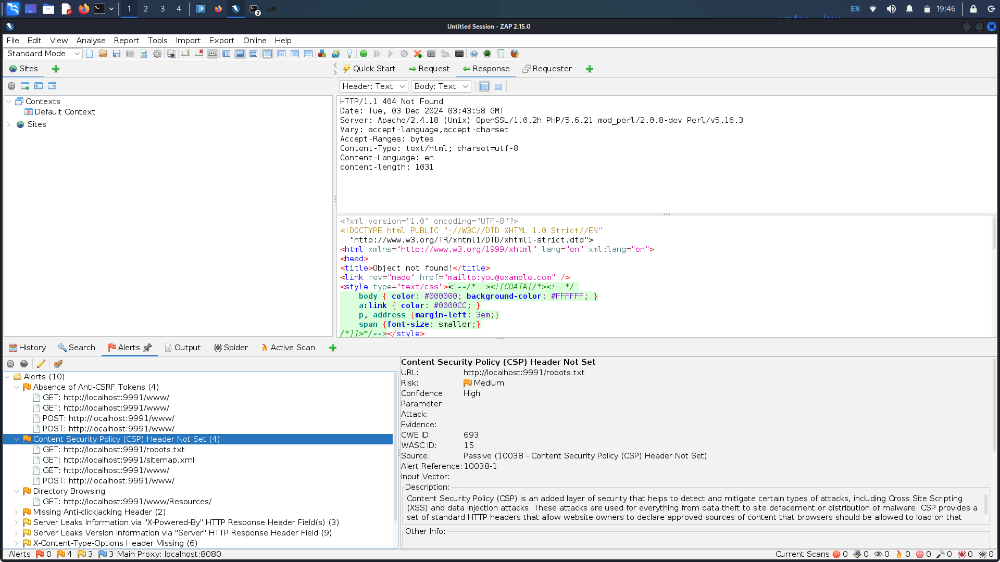

# My First DevSecOps Project

This project demonstrates a simple DevSecOps pipeline using a vulnerable web application. The pipeline integrates multiple security tools to help identify vulnerabilities in different stages of development. It includes Static Application Security Testing (SAST), Software Composition Analysis (SCA), and Dynamic Application Security Testing (DAST), all of which are critical in ensuring the security of modern applications.

The code used for this project is based on the [OWASP Vulnerable Web Application](https://github.com/OWASP/Vulnerable-Web-Application), which provides a vulnerable web app designed specifically for testing and learning purposes.

The project features:

- **SAST (SonarQube)** for static analysis of the code.
- **SCA (Trivy)** to check for vulnerabilities in dependencies.
- **DAST (OWASP ZAP)** for dynamic application security testing during runtime.
- **Docker**: to containerize the application, making it easy to deploy

## Steps of my Simple Pipeline

### Application Source Code
To start working on the project, I first cloned the vulnerable web application from the official [OWASP Vulnerable Web Application repository](https://github.com/OWASP/Vulnerable-Web-Application). After cloning the repository, I opened the application’s source code in **VS Code**

## Running SAST
I ran the SAST (Static Application Security Testing) scan using SonarQube. I hosted SonarQube on a docker container as well as the Sonar-Scanner Cli to provide an isolated environment for my scan.

## SAST Login
Once the SonarQube container was up and running, I accessed the web interface by navigating to `http://localhost:9000` in my browser. From there, I logged into SonarQube using my login credentials and started the SAST analysis on my vulnerable application’s source code. Here’s how the login page looked after I accessed the local SonarQube instance.

## SAST Results
Here, I can see the detailed results of the SAST scan, including the security issues, code smells, and other potential improvements for the application. This is where I analyze the identified issues to plan for fixes in the code.

## SCA (Trivy)
Next, I ran Trivy, a Software Composition Analysis (SCA) tool, to scan for vulnerabilities in the application’s dependencies, and outputted scan results to a file lcoally. This step checks for any outdated or vulnerable libraries that could introduce security risks. This project doesn't use any libraries so the Trivy scan didn't output anything to the text file, but I wanted to do this step anyways to practice using the tool.

### Trivy Scan

## Dockerizing the Source Code
In this step, I containerize the vulnerable web application using Docker. Containerizing the application ensures that it runs consistently across different environments, making it easier to manage and deploy during testing and in production. Also just so I can get some runtime on the application and be able to actually run the dast scan.

## DAST (OWASP ZAP)
I then set up and run the DAST (Dynamic Application Security Testing) process using OWASP ZAP. This tool simulates attacks on the application to identify runtime vulnerabilities. It tests the application as it would be accessed by a real attacker, identifying issues like XSS, SQL injection, and more.

### Running DAST

## DAST Results
Finally, after the scan is completed, I review the DAST results. These findings highlight any vulnerabilities that could be exploited during runtime. The DAST tool gives me insights into vulnerabilities that static code analysis (SAST) may not have detected.

## Next Steps
I this is just a starting point on my journey into learning DevSecOps. I hope to update this project or create new ones highlighting CI/CD practices and use automation tools like Jenkins and GitHub Actions to streamline my pipeline. 
